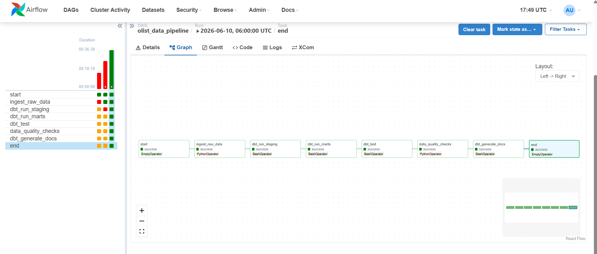
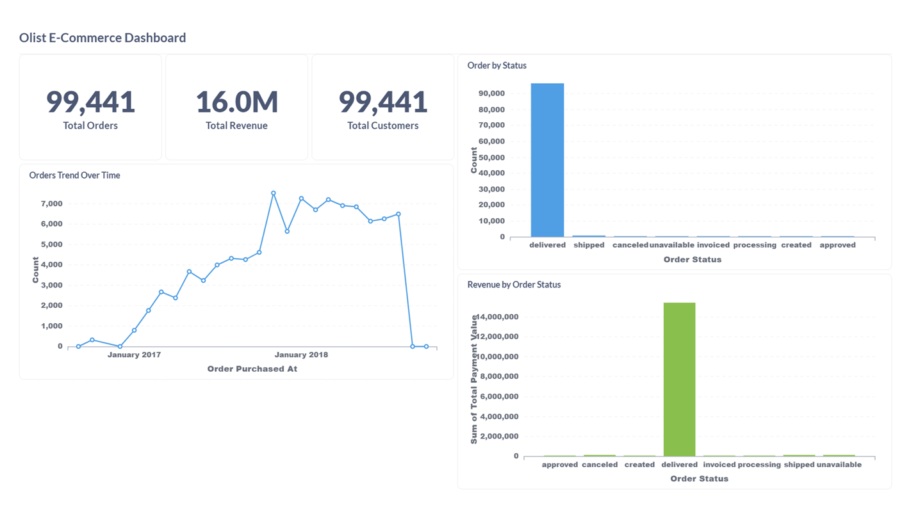

# Olist E-Commerce Data Pipeline

An end-to-end Data Engineering project built using the Brazilian Olist E-Commerce dataset. This project demonstrates modern data engineering practices including data ingestion, orchestration, transformation, data quality validation, warehousing, containerization, CI/CD, and business intelligence dashboards.

---

# Project Overview

The pipeline ingests raw Olist CSV datasets into PostgreSQL, transforms them using dbt into an analytics-ready warehouse, orchestrates workflows with Apache Airflow, and visualizes business insights through Metabase dashboards.

Key objectives:

* Build a production-style ETL pipeline
* Implement a layered warehouse architecture
* Create analytical fact and dimension tables
* Automate workflows using Airflow
* Apply data quality checks
* Deliver business insights through dashboards
* Follow software engineering best practices with GitHub Actions and Docker

---

# 🏗️ Architecture

```text
                ┌───────────────────┐
                │   Olist CSV Data  │
                └─────────┬─────────┘
                          │
                          ▼
                ┌───────────────────┐
                │ Apache Airflow    │
                │ Orchestration     │
                └─────────┬─────────┘
                          │
                          ▼
                ┌───────────────────┐
                │ PostgreSQL        │
                │ Raw Data Layer    │
                └─────────┬─────────┘
                          │
                          ▼
                ┌───────────────────┐
                │ dbt Core          │
                │ Transformations   │
                └─────────┬─────────┘
                          │
                          ▼
                ┌───────────────────┐
                │ Analytics Layer   │
                │ Star Schema       │
                └─────────┬─────────┘
                          │
                          ▼
                ┌───────────────────┐
                │ Metabase          │
                │ Dashboards        │
                └───────────────────┘
```

---

# 🔄 Data Pipeline Flow

## 1. Data Ingestion

* Loads 9 Olist CSV files into PostgreSQL raw tables
* Automated using Apache Airflow
* Includes ingestion tracking and logging

## 2. Data Transformation

Implemented using dbt.

### Staging Layer

* Data cleaning
* Type conversions
* Column standardization
* Source abstraction

### Mart Layer

* Fact table creation
* Dimension table creation
* Business metrics generation
* Star schema implementation

## 3. Data Quality Validation

Implemented through:

### dbt Tests

* Unique constraints
* Not-null constraints
* Business rule validations

### Custom Quality Checks

* Fact table row count validation
* Revenue validation
* Null value detection
* Dimension completeness checks

## 4. Business Intelligence

Interactive dashboards created in Metabase for business reporting and analytics.

---

# ⭐ Data Model

## Fact Table

### fct_orders

Contains order-level metrics including:

* Order information
* Payment metrics
* Revenue metrics
* Order status

## Dimension Tables

### dim_customers

Contains:

* Customer information
* Customer lifetime metrics
* Customer segmentation attributes

### dim_products

Contains:

* Product information
* Product sales metrics
* Product category details

---

# 📊 Dashboard KPIs

The Metabase dashboard provides:

### Executive Metrics

* Total Orders
* Total Revenue
* Total Customers

### Business Insights

* Orders Trend Over Time
* Orders by Status
* Revenue by Order Status
* Customer Analytics
* Product Analytics

---

# 🛠️ Tech Stack

| Layer            | Technology         |
| ---------------- | ------------------ |
| Orchestration    | Apache Airflow 2.8 |
| Transformation   | dbt Core 1.7       |
| Data Warehouse   | PostgreSQL 15      |
| Visualization    | Metabase           |
| Containerization | Docker             |
| CI/CD            | GitHub Actions     |
| Programming      | Python             |
| Query Language   | SQL                |
| Version Control  | Git & GitHub       |

---

# 📂 Dataset

Dataset: Brazilian E-Commerce Public Dataset by Olist

Dataset Characteristics:

* ~100,000 orders
* 9 source tables
* 2016–2018 transaction data
* Real-world e-commerce business dataset

Source:

https://www.kaggle.com/datasets/olistbr/brazilian-ecommerce

---

# 🚀 Quick Start

## Clone Repository

```bash
git clone https://github.com/Priyanshupriyaa/olist-data-pipeline.git
cd olist-data-pipeline
```

## Download Dataset

Create a `data/` folder and place all Olist CSV files inside it.

## Start Services

```bash
docker compose up -d
```

## Access Applications

### Airflow

URL:

http://localhost:8080

Credentials:

```text
Username: admin
Password: admin
```

### Metabase

URL:

http://localhost:3000

### PostgreSQL

```text
Host: localhost
Port: 5432
Database: olist_warehouse
User: airflow
Password: airflow
```

---

# ▶️ Running the Pipeline

1. Open Airflow UI
2. Locate `olist_data_pipeline`
3. Trigger the DAG
4. Monitor execution in Graph View
5. Verify dbt transformations
6. Explore dashboards in Metabase

Pipeline Steps:

```text
Raw Ingestion
      ↓
dbt Staging
      ↓
dbt Marts
      ↓
dbt Tests
      ↓
Data Quality Checks
      ↓
Dashboard Consumption
```

---

# 📁 Project Structure

```text
olist-data-pipeline/
│
├── dags/
│   └── olist_pipeline.py
│
├── ingestion/
│   └── ingest_raw.py
│
├── dbt/
│   ├── models/
│   │   ├── staging/
│   │   └── marts/
│   ├── dbt_project.yml
│   └── profiles.yml
│
├── scripts/
│
├── data/
│
├── images/
│   ├── airflow-dag.png
│   └── metabase-dashboard.png
│
├── .github/
│   └── workflows/
│       └── ci.yml
│
├── docker-compose.yml
├── requirements.txt
└── README.md
```

---

# 🔍 Data Quality Checks

Implemented validations:

* Fact table contains records
* No null order IDs
* Customer dimension validation
* Revenue validation
* dbt schema tests
* Business rule validation

---

# ⚙️ CI/CD

GitHub Actions automatically performs:

* Python linting using Flake8
* dbt parse validation
* SQL linting using SQLFluff
* Docker Compose validation
* Docker image build verification

---

# 📸 Project Screenshots

## Airflow DAG



## Metabase Dashboard



---

# 🎯 Key Achievements

* Processed 99K+ customer orders
* Loaded over 1 million geolocation records
* Built analytics-ready warehouse models
* Implemented Star Schema design
* Automated ETL orchestration with Airflow
* Created dbt transformation layer
* Added CI/CD validation through GitHub Actions
* Developed business dashboards in Metabase
* Containerized entire project using Docker

---

# 👩‍💻 Author

**Priyanshu**

B.Tech, Computer Science Engineering
National Institute of Technology Patna

GitHub: https://github.com/Priyanshupriyaa

---

⭐ If you found this project useful, consider giving it a star.
